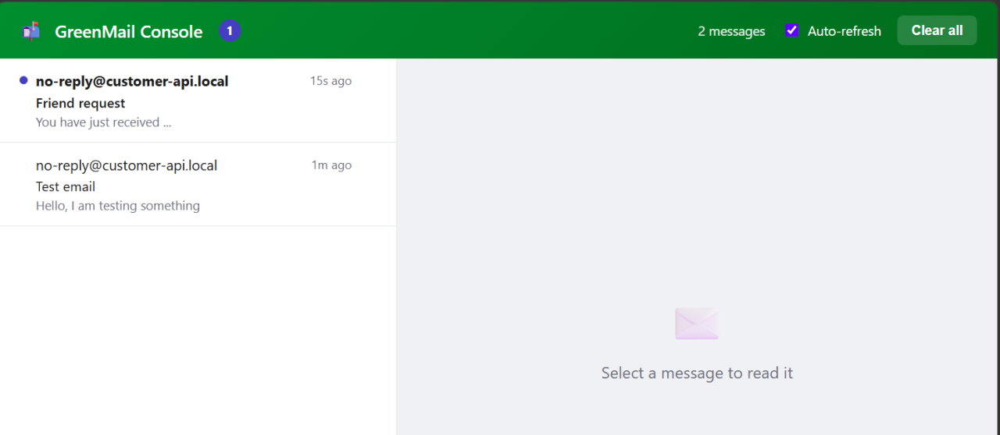

# greenmail-console-spring-boot-starter

An in-memory [GreenMail](https://greenmail-mail-test.github.io/greenmail/) SMTP server with a
lightweight web console, packaged as a Spring Boot auto-configuration starter. Drop it onto a
local development classpath to catch outgoing mail without needing Docker, a real mail server, or
an external SMTP-testing service — everything runs embedded in the JVM and is inspectable from a
browser.

## Why I built this

I kept needing a real SMTP endpoint while developing — to test code that sends email — but the
usual options were awkward: spin up a Docker container, run a separate mail server, or (worst of
all) send test mail through a shared online service. I wanted something a whole team could use
during development with zero setup: an SMTP server that lives inside the app's own JVM, catches
every outgoing message, and lets you read those messages from a browser. No Docker, no external
process, nothing sensitive leaving the machine. That's what this starter is.

## Features

- 📥 **Inbox UI** with read/unread state and an unread count
- 🕒 **Arrival time** per message (relative in the list, absolute in the detail)
- 🧾 **Message detail** with **HTML**, **Plain text**, **Headers**, and raw **Source** tabs
- 📎 **Attachments** (downloadable) and **inline images** (`cid:`) rendered in place
- 👥 Shows **From / To / Cc** and the total **email size**
- 🧹 **Delete** a single message or **clear all**
- 🔁 **De-duplicates** per-recipient copies — one row per email
- 🔌 **Zero-config** Spring Boot auto-configuration — off by default, enabled via one property
- 💾 **Two storage modes** — in-memory (default, cleared on restart) or `file` (mail mirrored to `.eml` files that survive restarts)
- 🚫 **No Docker**, no external process — everything runs embedded in the JVM

## Screenshots



## Why not MailHog / Mailpit / a Docker mail server?

A Docker mail catcher like MailHog or Mailpit is the usual way to catch outgoing mail in
development. This starter targets a different sweet spot:

| | This starter | MailHog / Mailpit (Docker) |
|---|---|---|
| **Docker daemon** | Not required | Required |
| **Startup** | Milliseconds (in-JVM) | Seconds (pull + container boot) |
| **Runs as** | Embedded in your app's JVM | A separate process / container |
| **Where mail lives** | JVM heap, or `.eml` files on disk | Container filesystem |
| **Inspect mail** | Browser console, live | Separate web UI |
| **CI without Docker** | Works | Needs Docker-in-Docker or a daemon |
| **Fidelity to a real server** | Real SMTP receive, simplified backend | Full standalone server |

Use MailHog or Mailpit when you want a standalone mail catcher shared across many services or
languages. Use this starter when you want a fast, zero-infrastructure SMTP endpoint embedded in
your own app — no daemon, no image pull, no separate process — that you can *see into* from a
browser.

## Do I need to run anything separately?

**No.** The GreenMail SMTP server and the web console run **embedded inside your
application's JVM** — they start automatically when your app boots with the console
enabled. There is no separate process, service, or Docker container to launch. Just start
your app as usual and open the console URL in a browser.

## Installation (one-time, per machine)

This starter is **not published to a Maven repository (e.g. Maven Central) yet** — so build and
install it into your local Maven repository (`~/.m2`) once. After that you can add it as a
dependency to *any* project on your machine:

```bash
git clone https://github.com/pmoustopoulos/greenmail-console-spring-boot-starter.git
cd greenmail-console-spring-boot-starter
mvn clean install              # installs io.github.pmoustopoulos:greenmail-console-spring-boot-starter:0.1.1 into ~/.m2
```

Re-run `mvn clean install` whenever you change the starter's code so consumers pick up the new jar.
(This project targets Java 25.)

## Usage

**1.** Add this starter **and** Spring Boot's mail starter (the latter provides the
`JavaMailSender` your app uses to send mail):

```xml
<dependency>
    <groupId>io.github.pmoustopoulos</groupId>
    <artifactId>greenmail-console-spring-boot-starter</artifactId>
    <version>0.1.1</version>
</dependency>

<dependency>
    <groupId>org.springframework.boot</groupId>
    <artifactId>spring-boot-starter-mail</artifactId>
</dependency>
```

**2.** Enable it in a development configuration profile, and point your mail sender at the
embedded SMTP server — using either `application.properties`:

```properties
greenmail.console.enabled=true

spring.mail.host=localhost
spring.mail.port=3025
```

...or `application.yml`:

```yaml
greenmail:
  console:
    enabled: true

spring:
  mail:
    host: localhost
    port: 3025
```

**3.** Start your application. The console URL (with the correct port and context path) is
logged at startup, e.g.:

```
----------------------------------------------------------------
  GreenMail mail console:   http://localhost:8080/mail-console
  SMTP listening:            localhost:3025
  Storage:                   in-memory (cleared on restart)
----------------------------------------------------------------
```

Open that URL in a browser to view captured mail. The base path is
`http://<host>:<app-port><context-path>/mail-console`.

## Configuration properties

| Property                      | Default          | Description                                                        |
|--------------------------------|-------------------|----------------------------------------------------------------------|
| `greenmail.console.enabled`   | `false`           | Master switch. The embedded SMTP server, console UI, and API only register when this is `true`. |
| `greenmail.console.smtp-port` | `3025`            | Port the embedded GreenMail SMTP server listens on.                |
| `greenmail.console.path`      | `/mail-console`   | Base path the console UI and its REST API are served under.        |
| `greenmail.console.storage`   | `memory`          | Where captured mail is kept: `memory` (in-heap, cleared on restart) or `file` (mirrored to `.eml` files on disk that persist across restarts, like H2's file mode). |
| `greenmail.console.directory` | `mail-data`       | Directory used when `storage=file`. Created if missing; messages are written here as `.eml` files and reloaded on startup. Ignored for `memory`. |
| `greenmail.console.persist-interval` | `2s`       | How often newly received mail is flushed to disk when `storage=file`. Set to `0s` to disable the periodic flush. Ignored for `memory`. |

### Storage: in-memory vs. file

By default captured mail lives in the JVM heap (GreenMail's own store) and is cleared on restart —
great for tests and quick demos. To keep mail across restarts (like H2's file mode), switch to
`file` storage and point it at a directory:

```yaml
greenmail:
  console:
    enabled: true
    storage: file           # memory (default) | file
    directory: ./mail-data  # where .eml files are written when storage=file
```

The directory is created if missing. Each received message is mirrored to an `.eml` file shortly
after it arrives, and those files are reloaded into the console on the next startup — so your
captured mail (and its original arrival time) survives a restart. Deleting a message, or using
**clear all**, removes it from disk too. Still development-only.

## ⚠️ Development only

**Never enable this starter in production.** Only turn it on under a dedicated local/dev profile
(e.g. `spring.profiles.active=dev` gating `greenmail.console.enabled=true`), never in a profile
that could be active in a deployed environment.

**Security interaction to be aware of:** when enabled, this starter registers its own
`SecurityFilterChain`, scoped to the console path (`greenmail.console.path` + `/**`), at
`@Order(Ordered.HIGHEST_PRECEDENCE)`, with `permitAll()` and CSRF disabled — so the console itself
is intentionally open, with no authentication required.

Spring Boot's default security auto-configuration backs off automatically as soon as **any**
`SecurityFilterChain` bean exists in the context. This means that if your application relies
entirely on Boot's default security (i.e. it does not define a `SecurityFilterChain` of its own),
enabling this console becomes the *only* security chain in the app. Because the console's chain is
scoped solely to the console path, every other path in the application is left with no security
filter applied at all — effectively unauthenticated.

**If you rely on Spring Boot's default security, you must define your own `SecurityFilterChain`
covering the rest of your application before enabling this console.** Applications that already
define their own security configuration (as most real applications do) are unaffected: their
chain continues to protect all non-console paths as configured.

## License

Licensed under the [Apache License, Version 2.0](LICENSE). You are free to use, modify, and
distribute it, including commercially.

This project depends on, but does not include the source of, third-party libraries that remain
under their own licenses — notably [GreenMail](https://greenmail-mail-test.github.io/greenmail/)
and Spring Boot (both Apache 2.0) and Jakarta Mail (EPL 2.0 / EDL). "GreenMail" is the name of a
separate project; this starter is an independent wrapper and is not affiliated with or endorsed by it.

## Acknowledgments

- Powered by [GreenMail](https://greenmail-mail-test.github.io/greenmail/) and
  [Spring Boot](https://spring.io/projects/spring-boot).
